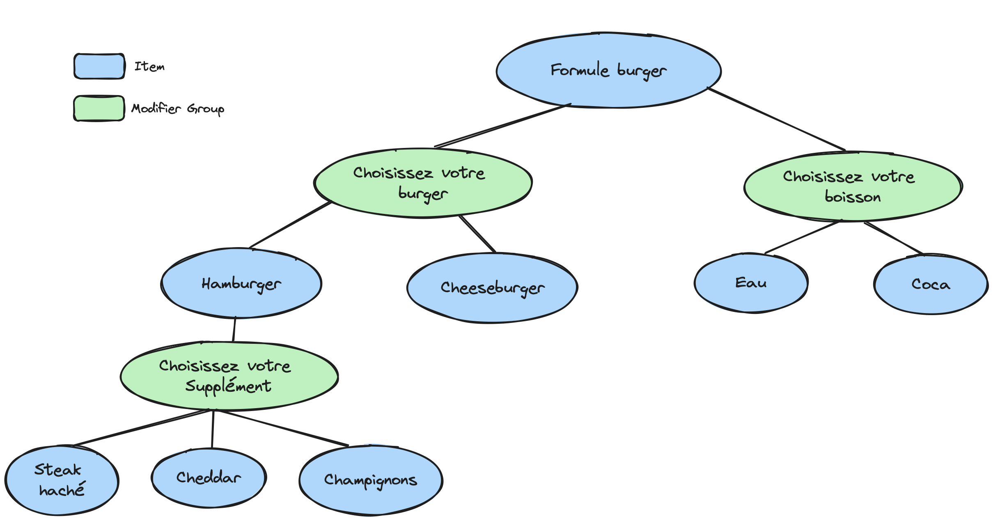

# Clone technical test

At Clone, we have an app that allows the user to create and edit a menu, and push it to the delivery platforms.

In this exercise, we will implement the menu mapper module of this application.

A menu has the following structure :
- Menu
    - Category 1
        - Item 1
        - Item 2
        - ...
        - Item 10
    - Category 2
        - Item 1
        - ...
    - ...
    - Category 7

An Item has the following structure
- Item 
    - Modifier Group 1
        - Item 1
        - Item 2
        - Item 3
    - Modifier Group 2
        - Item 1
            - Modifier Group 1
                - Item 1
                - Item 2
        - Item 2
    - Modifier Group 3
        - Item 1

An Item is a nested structure containing Modifier Groups (aka option groups), which in turn contains a list of items.

